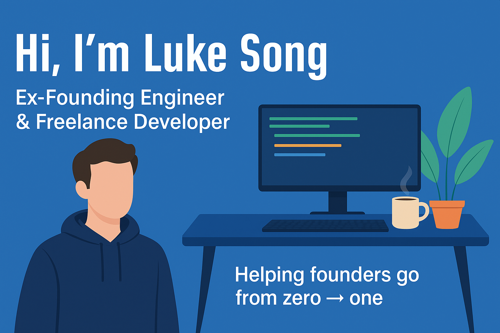
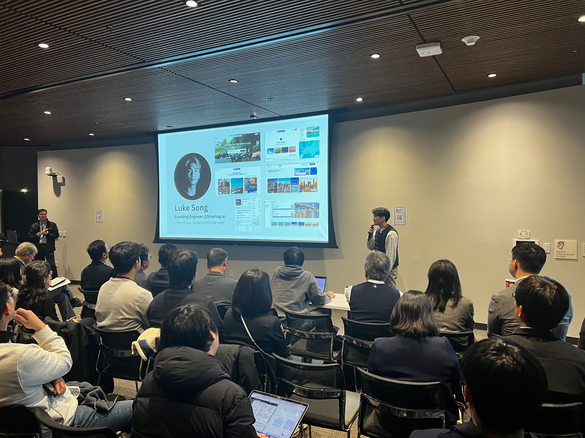

<!-- Banner image -->

  

Hi, there! I am Luke: Ex-founding Engineer & Freelance Software Engineer. This is my profile page to outline some of the things I'm working on today.

## 👨‍💻 Open Source

- **Gateway Protocol v2 (Identity.com)**  
  Developed and launched a decentralized, semi-trustless protocol for managing Gateway Passes, including Rust smart contracts, TypeScript client service, and full documentation. Achieved 100% unit test coverage.  
  _Stack: Rust, TypeScript, Mocha, Jest_  
  [Identity.com Open Source](https://github.com/identity-com/on-chain-identity-gateway)

## 👨‍💻 Projects

- **IDENFTs (Public)**  
   Built an NFT marketplace enabling IPFS uploads and blockchain data retrieval via API. Implemented smart contract integration and IPFS storage functionality for NFT management.  
   _Stack: Solidity, Web3.js, IPFS, React_
  [Idenfts Open Source](https://github.com/luke-song/idenfts)

- **Smartrip.ai**  
  AI-powered travel concierge integrating booking, flights, and activities into one seamless platform. Led full-stack product development, UI refinement, and a product pivot to a conversational chat-based interface.  
  _Stack: Figma, Tailwind CSS, ShadCN, TypeScript, React, Next.js, Python (Flask), MongoDB, LLAMA_

- **KHProduction**  
  Designed and built a mobile-first app and SEO-optimized site with CRM, handling branding, prototyping, UI, and implementation from scratch. Helped validate product-market fit.  
  _Stack: Figma, Tailwind CSS, TypeScript, React, Next.js_

- **Amber (Tesla Protection Plan)**  
  Built a full-stack underwriting web app, increasing conversions by 2%+ through improved UI and process optimization.  
  _Stack: Figma, Tailwind CSS, ShadCN, TypeScript, React, Next.js, MongoDB_

- **Voxtodo**  
  Designed UI for an AI-powered task manager, integrating Google Calendar and task alerts. Achieved 1,500+ user acquisition.  
  _Stack: Figma, HTML, CSS, Python (FastAPI)_

- **ContinuityCompass (Gov Compliance Tool)**  
  Designed and developed an accessibility compliance tool UI aligned with U.S. Web Design System (USWDS), enabling government agencies to validate website accessibility.  
  _Stack: React.js, Tailwind CSS, Material UI_

- **Appointzen**  
  Conducted user research with elderly hospital patients and developed a cross-platform mobile app for appointment scheduling, launched on Google Play Store.  
  _Stack: Flutter, Node.js, AWS, Material UI, Microsoft CodePush, GitHub Actions_

> _"If you cannot fail, you cannot learn. As you consider building your own minimum viable product, let this simple rule suffice: remove any feature, process, or effort that does not contribute directly to the learning you seek."_  
> — Eric Ries, The Lean Startup

  

