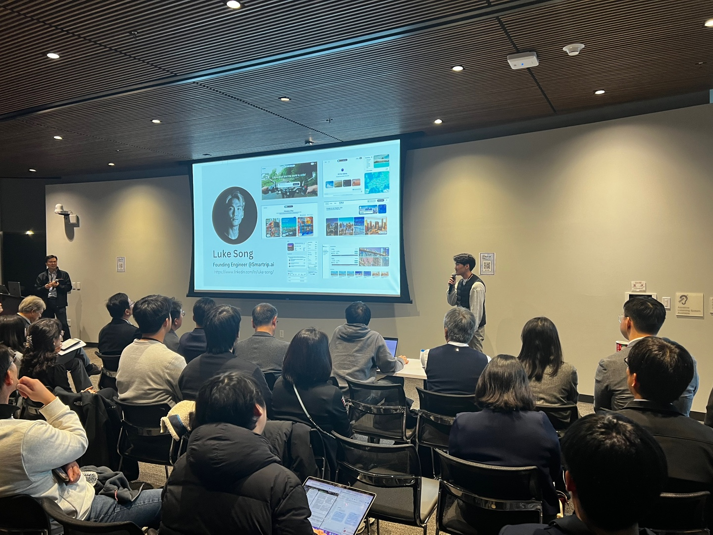

Hi, there! I am Luke, a product engineer who designs the screen and then ships it.

Most of my work sits where design and engineering overlap. I draw the interface in Figma, build it in React or React Native, and own the backend it talks to. Today I am building AWOD solo and taking freelance work.

**[Portfolio](https://hyeongdesign.vercel.app)** · San Jose, CA

## Now

- **[AWOD](https://www.awod.website)** (solo, live on TestFlight)  
  An AI workout coach for iOS. I built it because I train, and every app I tried programmed for somebody else. The coach reads your actual program and swap history, so "why this exercise" gets a specific answer instead of a generic one. Korean and English throughout, and a type scale rebuilt as tokens so every screen survives 300%+ Dynamic Type.  
  _Stack: React Native, Expo Router, TypeScript, Supabase Edge Functions, OpenAI_

## Selected work

- **[CREE8](https://cree8.io)** (Jun 2025 to Jul 2026)  
  Cloud post-production for film and creative teams: GPU workstations, shared storage, and review tools in the browser, secure enough for major studios (SOC 2, TPN). I shipped 40+ production features across the platform. Our product designer and I built the mobile design file together, then I built the app from it, so the file and the shipped product never drifted into two different products.  
  _Stack: Figma, TypeScript, React, Next.js, Tailwind CSS_

- **[Bottlely](https://bottlely.vercel.app)** (co-founder, now Ventory)  
  Chat-native ordering for bars. A bartender texts what they need mid-shift, spell-tolerant retrieval resolves it against the catalog, and inventory updates itself. We piloted it in a real venue at 95%+ order accuracy, cutting manual entry by around 80%. That inventory layer is where we are taking it next, as Ventory.  
  _Stack: TypeScript, Next.js, Supabase, OpenAI_

- **[Smartrip.ai](https://smartrip.ai)** (ex-founding engineer)  
  AI travel concierge for booking, flights, and activities. I led the frontend rebuild, and we replaced the trip-request form with a conversation, because the form was asking users for answers they did not have yet.  
  _Stack: Figma, Tailwind CSS, ShadCN, TypeScript, React, Next.js, Python (Flask), MongoDB, LLAMA_

- **IDENFTs** (public)  
  NFT marketplace with IPFS uploads and on-chain data retrieval through an API, plus smart contract integration for minting and managing NFTs.  
  _Stack: Solidity, Web3.js, IPFS, React_

<b>Earlier work</b>

 

- **KHProduction / Poppix**  
  Designed and built a mobile-first app and an SEO-optimized site with a CRM, handling branding, prototyping, UI, and implementation from scratch. Helped validate product-market fit.  
  _Stack: Figma, Tailwind CSS, TypeScript, React, Next.js_

- **Amber (Tesla Protection Plan)**  
  Full-stack underwriting web app. Reworking the UI and the quote flow lifted conversions by 2%+.  
  _Stack: Figma, Tailwind CSS, ShadCN, TypeScript, React, Next.js, MongoDB_

- **Voxtodo**  
  UI for an AI task manager with Google Calendar sync and task alerts. Reached 1,500+ users.  
  _Stack: Figma, HTML, CSS, Python (FastAPI)_

- **ContinuityCompass (gov compliance tool)**  
  Accessibility compliance tool built to the U.S. Web Design System, so agencies can validate their own sites against it.  
  _Stack: React, Tailwind CSS, Material UI_

- **Appointzen**  
  Ran user research with elderly hospital patients, then built a cross-platform appointment scheduling app and shipped it to the Google Play Store.  
  _Stack: Flutter, Node.js, AWS, Material UI, Microsoft CodePush, GitHub Actions_

## Reach me

Hiring a product engineer, or need one screen built properly? [Email me](mailto:hyeonminsong7@gmail.com) or [book a call](https://calendly.com/hyeonminsong7/one-on-one).

> _"If you cannot fail, you cannot learn. As you consider building your own minimum viable product, let this simple rule suffice: remove any feature, process, or effort that does not contribute directly to the learning you seek."_  
> Eric Ries, The Lean Startup

  

